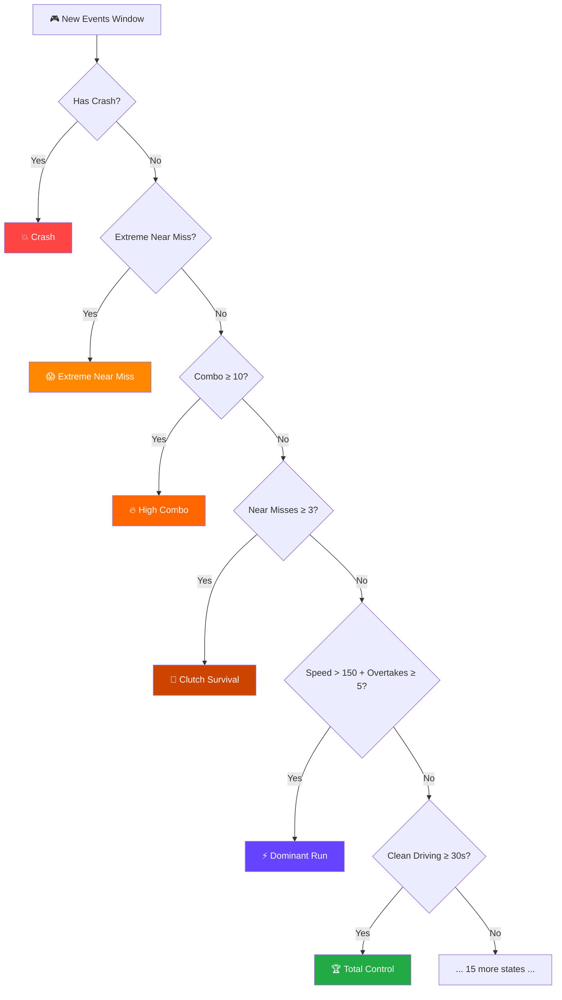
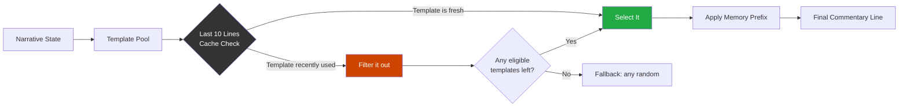
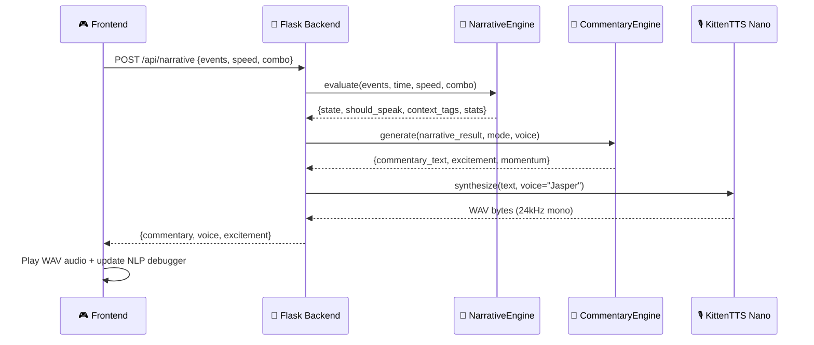
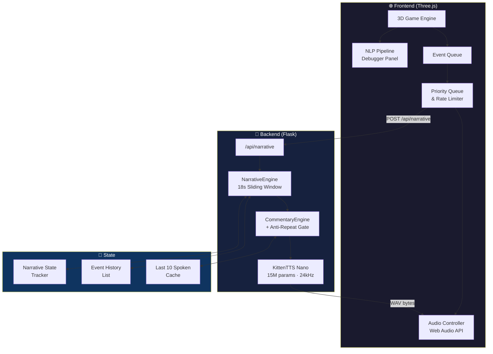

<div align="center">

# 🏎️ RoadCaster

### *Every Close Call Has a Story.*

**A 3D highway driving game powered by a real-time Computational Linguistics engine —**  
**where Natural Language Generation and Text-To-Speech bring every near-miss to life.**

---

[](https://linghacks-vii.devpost.com/)
[](https://python.org)
[](https://flask.palletsprojects.com/)
[](https://threejs.org/)

</div>

---

## 🎯 What Is RoadCaster?

RoadCaster is a **browser-based 3D highway driving game** with a twist: it has a brain.

Every time you swerve, dodge, overtake, or crash, the game sends a structured event to a custom **Natural Language Processing backend** that determines *what just happened*, *how exciting it is*, and *what the commentator should say* — all in real-time, delivered as synthesized voice audio.

This is not a chatbot. This is not a text summarizer. This is **applied Computational Linguistics inside a game.**

> *Built for [LingHacks VII](https://linghacks-vii.devpost.com/) — the world's first computational linguistics hackathon for high schoolers.*

---

## ✨ The Big Idea

Most games play background music. RoadCaster plays **live commentary**.

The challenge: how do you generate commentary that feels *natural*, *contextual*, *non-repetitive*, and *timely* — all from raw game physics data?

The answer: **CASCE** — the Context-Aware Sports Commentary Engine.

---

## 🧠 CASCE: The NLP Engine

```
┌─────────────────────────────────────────────────────────────────────────────┐
│                         CASCE: The NLP Pipeline                             │
│                                                                             │
│  🎮 Gameplay          🏷️ Context           🧮 Narrative         🔊 Voice    │
│  ─────────           ─────────           ──────────           ──────       │
│  Physics Data    →   Classification  →   State Engine    →   TTS Output   │
│  (speed, lane,       (event type,        (momentum,          (Kitten TTS  │
│   proximity,          danger level,       transitions,         15M Nano    │
│   combo, time)        context tags)       anti-repeat)         model)      │
└─────────────────────────────────────────────────────────────────────────────┘
```

### Stage 1 — Event Classification

Every frame, the frontend sends a structured **event payload** to the Flask backend:

```json
{
  "event": "extreme_near_miss",
  "speed": 187,
  "combo": 7,
  "timestamp": 42.3,
  "lane": 1
}
```

### Stage 2 — Context Tagging

The **NarrativeEngine** ingests a sliding 18-second window of events and computes:

| Context Tag | Trigger Condition |
|---|---|
| `pressure_rising` | Traffic density jumps from low → heavy |
| `masterclass_streak` | 20+ seconds of clean, uninterrupted driving |
| `high_speed` | Average speed > 150 km/h |
| `combo_5` | Combo chain ≥ 5 consecutive near-misses |

### Stage 3 — Narrative State Engine

This is the heart of CASCE. A **priority-ordered rule engine** maps the 18-second event window to one of **20 named narrative states**:



<details>
<summary><b>📋 All 20 Narrative States (click to expand)</b></summary>

| Priority | State | Trigger |
|---|---|---|
| 1 | 💥 **Crash** | Player collides |
| 2 | 😱 **Extreme Near Miss** | Dangerously close dodge |
| 3 | 🔥 **High Combo** | Combo chain ≥ 10 |
| 4 | 🎯 **Clutch Survival** | 3+ near-misses in window |
| 5 | 😰 **Panic Driving** | High events, low speed |
| 6 | 🌪️ **Traffic Chaos** | 6+ events, high speed |
| 7 | ⚠️ **High Risk Driving** | Near miss + speed > 140 |
| 8 | ⚡ **Elite Reactions** | Combo ≥ 5 |
| 9 | 🛡️ **Untouchable** | Clean 15s + 4 overtakes |
| 10 | 💨 **Dominant Run** | Speed > 150 + 5 overtakes |
| 11 | 🧙 **Highway Wizard** | 3 lane changes + 3 overtakes |
| 12 | 🔪 **Traffic Surgeon** | 2 lane changes + 2 overtakes, no near-misses |
| 13 | 🎯 **Precision Driving** | Clean 15s + lane changes + overtakes |
| 14 | 👑 **Total Control** | 30+ seconds clean |
| 15 | 🏆 **Masterclass** | 25+ seconds clean |
| 16 | 🌊 **Flow State** | 20s clean + 2 overtakes |
| 17 | 🎸 **Controlled Aggression** | 4+ overtakes, no near-misses |
| 18 | 🚀 **Record Pace** | Speed > 175 km/h |
| 19 | 📈 **Building Momentum** | 3+ overtakes |
| 20 | 🔄 **Traffic Weaving** | 2+ lane changes |

</details>

### Stage 4 — Template Selection & Anti-Repetition Gate



The **anti-repetition gate** ensures no commentary line is repeated within the last 10 spoken lines — making the experience feel dynamic and fresh across a full session.

**Context Memory Prefixes** are prepended when special conditions are detected:
- `"The pressure is rising now! "` → when traffic density spikes
- `"This has been a masterclass in control! "` → after a sustained clean streak

### Stage 5 — Priority Queue & Rate Limiter

The frontend enforces a **2.5-second cooldown** between commentary lines with a **priority queue**:

```
CRASH > EXTREME NEAR MISS > HIGH COMBO > NEAR MISS > OVERTAKE > NORMAL
```

This prevents voice-over overlap and ensures the most dramatic moments always get airtime.

### Stage 6 — Kitten TTS Voice Synthesis



The **KittenTTS Nano** (15M parameter model) synthesizes each commentary line to a 24kHz mono WAV and streams it back to the browser for immediate playback.

---

## 🎙️ Three Commentator Personalities

| Mode | Voice | Style | Example |
|---|---|---|---|
| 🏟️ **Sports Broadcast** | Jasper | High-energy, reactive, excited | *"OH NO! A COLLISION! AAAAAAH! HA HA HA! GAME OVER!"* |
| 🎬 **Dramatic Narrator** | Hugo | Cinematic, dark, reflective | *"The highway always wins. In the end. Ha... ha... ha..."* |
| 😈 **Savage Critic** | Kiki | Sarcastic, witty jabs | *"HA HA HA! Wrecked! Hope you have insurance, because that was pathetic!"* |

Each personality has its own full **template library**, **excitement level mappings**, and **transition commentary** for state changes.

---

## 🏗️ Architecture



---

## 🛠️ Technology Stack

| Layer | Technology | Purpose |
|---|---|---|
| **3D Game** | Three.js 0.184.0 | WebGL highway rendering, vehicle meshes, physics |
| **Frontend** | Vanilla JS (ES Modules) | Event detection, queue management, audio playback |
| **Styling** | CSS3 + Glassmorphism | Dark mode UI with NLP debugger panel |
| **Backend** | Python 3.12 + Flask 3.0 | REST API, NLP pipeline orchestration |
| **NLG** | Custom Rule Engine | Narrative state classification, template selection |
| **TTS** | KittenTTS Nano (15M) | PyTorch/ONNX neural voice synthesis |
| **Audio** | NumPy + soundfile | PCM → WAV conversion (16-bit, 24kHz, mono) |
| **Package Manager** | uv | Fast Python dependency management |

---

## 🚀 Getting Started

### Prerequisites

- Python 3.12+
- [`uv`](https://docs.astral.sh/uv/) package manager

### Installation

```bash
# Clone the repository
git clone https://github.com/your-username/RoadCaster.git
cd RoadCaster

# Install all dependencies (including KittenTTS from GitHub release)
uv pip install -e .
```

> **Note:** The KittenTTS Nano model (~35MB weights) will be downloaded automatically on first startup.

### Running

```bash
python app.py
```

Then open **[http://localhost:5000](http://localhost:5000)** in your browser.

### Docker (Hugging Face Spaces)

The project ships with a `Dockerfile` targeting port `7860` for HuggingFace Spaces deployment.

---

## 🎮 How to Play

| Control | Action |
|---|---|
| `A` / `←` Arrow | Switch to the left lane |
| `D` / `→` Arrow | Switch to the right lane |
| `Space` / `↑` Arrow | Speed boost (hold) |
| `R` | Restart after crash |

**Scoring tips:**
- Getting as close as possible to traffic without hitting it builds your **combo multiplier**
- Sustained clean driving builds toward **Masterclass** and **Total Control** states
- Weaving through dense traffic at high speed unlocks **Highway Wizard** commentary

### 🔬 NLP Pipeline Debugger

Press the **toggle arrow** on the right side of the screen to expand the live debugger. It shows:

- Real-time **event JSON payloads** from the game
- Active **narrative state** and **context tags**
- Current **commentator voice** and **excitement level**
- **Momentum** trend (rising / calm / falling)

---

## 📂 Project Structure

```
RoadCaster/
├── app.py                  # Flask server + API routes
├── narrative.py            # NarrativeEngine — sliding window + state machine
├── commentary.py           # CommentaryEngine — template library + anti-repeat
├── action_narrator.py      # ActionNarrator — play-by-play physical action lines
├── game.py                 # Event schema validation
├── tts_provider.py         # KittenTTS integration + WAV encoding
├── pyproject.toml          # Project metadata + dependencies
├── Dockerfile              # Container setup for HF Spaces
├── templates/
│   └── index.html          # Game UI + Three.js 3D engine
└── static/
    └── ...                 # Assets
```

---

## 🏆 LingHacks VII — Why This Project?

LingHacks VII challenges teams to build software that **integrates computational linguistics** to solve a scientific or social problem. RoadCaster addresses this by:

1. **Natural Language Generation (NLG)** — A custom rule-based engine maps game physics to narrative prose. No LLM required; the language emerges from structured linguistic templates and contextual logic.

2. **Pragmatics & Context** — The commentary system models *discourse context* (commentator memory, anti-repetition), *prosody cues* (excitement levels passed to TTS), and *temporal grounding* (18-second event windows for situational awareness).

3. **Text-to-Speech Synthesis** — KittenTTS demonstrates applied speech synthesis: the same text spoken by Jasper (energetic), Hugo (cinematic), or Kiki (sardonic) feels completely different, showing how prosody and voice personality shape meaning.

4. **Human-Computer Interaction** — The NLP debugger panel makes the linguistics pipeline *visible and legible*, turning an invisible backend into an educational showcase of how NLG works in real time.

---

## 🔗 Links

- 🏁 **Hackathon**: [LingHacks VII on Devpost](https://linghacks-vii.devpost.com/)
- 🤗 **Live Demo**: [HuggingFace Spaces](https://huggingface.co/spaces/)
- 📦 **KittenTTS**: [KittenML/KittenTTS](https://github.com/KittenML/KittenTTS)

---

<div align="center">

*Made with ⚡ and way too much caffeine at LingHacks VII*

</div>
